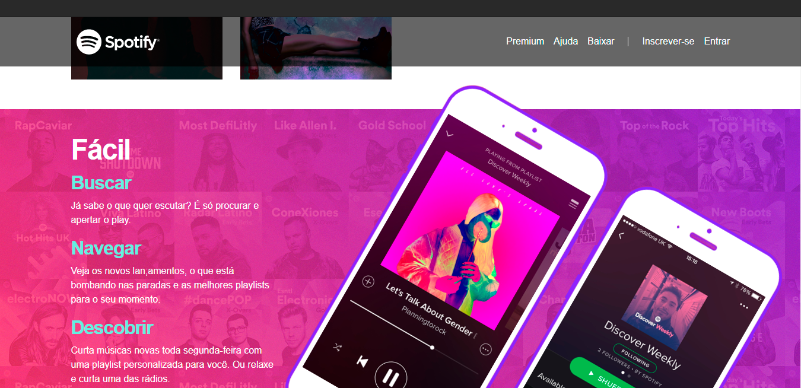

# Spotify Home Page

> Projeto com intuito de testar conhecimentos adiquiridos no bootstrap como grid, formatações de objetos  e responsividade. Projeto foi criado com Html, Css e Bootstrap.

## 📫 Contribuindo

Quer fazer parte desse projeto? É simples!
Faça um fork dele e coloque as suas modificações, depois mande um pull request.

## 🤝 Colaboradores

Agradecemos às seguintes pessoas que contribuíram para este projeto:

<table>
  <tr>
    <td align="center">
      <a href="https://github.com/juannunesz">
         
        
          <b>Juan Nunes</b>
        
      </a>
    </td>
  </tr>
</table>

